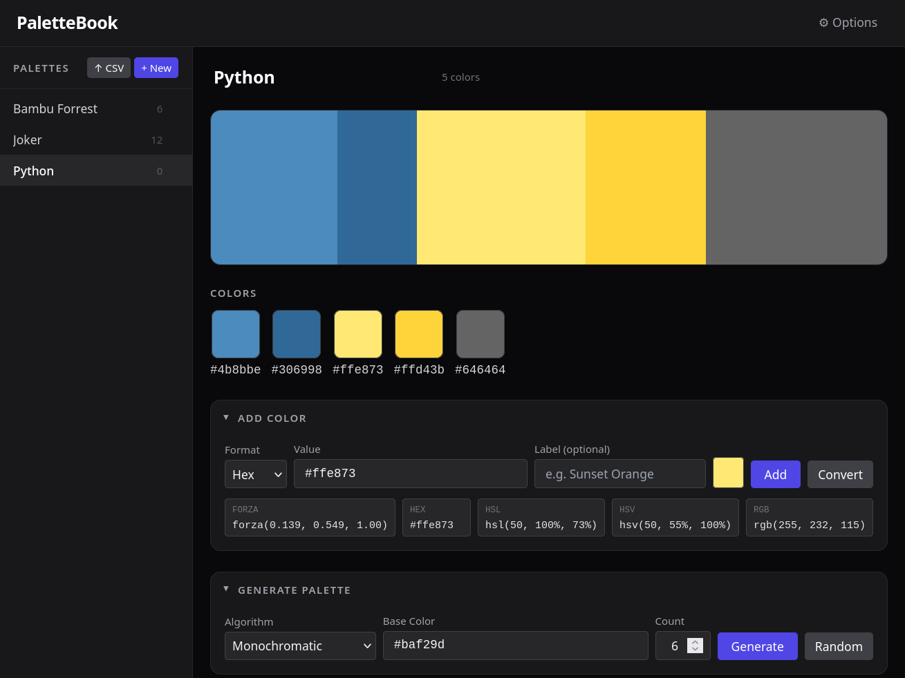

# PaletteBook

> PaletteBook is a locally hosted web application designed to help users manage and preview their color palettes. It provides an intuitive interface for organizing, viewing, and sharing color schemes, making it an essential tool for designers, artists, and anyone working with colors.
>
> ~ Copilot Auto-fill, 2026

## What is it Actually?

A locally hosted web app built on Python to allow you to create groups of colors and save them into a local database.

The intended use case is currently so that I can have it open via the Steam Overlay in a web page and have it open while working on Forza liveries. Obviously, this is very niche and specific for me but you can use it however you'd like!



## Installation

Currently while in development, you will need to clone the repository and run it locally. In the future, I hope to package it and make installation easier.

```bash
# Clone the repository
git clone https://github.com/RPINerd/palettebook.git
# Setup virtual environment and install dependencies
cd palettebook
uv sync
```

## Usage

Launching via uv (recommended):

```bash
uv run palettebook
```

Launching via Python:

```bash
source .venv/bin/activate
python -m palettebook
```
